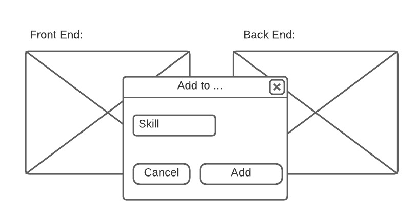

# Instructions

The goal of this exercise is to implement a simple application using the following technology stack:
 - React
 - React hooks
 - Flow
 - Relay

## TODO:

- User should see two lists of skills for knowledge areas (front-end and back-end) after navigation to the application.
- User should be able to add a new skill to the knowledge area with such flow:
  Click on the list -> add skill name in the modal dialog

## Mockup:

# Local Server

You can find the GQL server to interact in `./backend` dir.